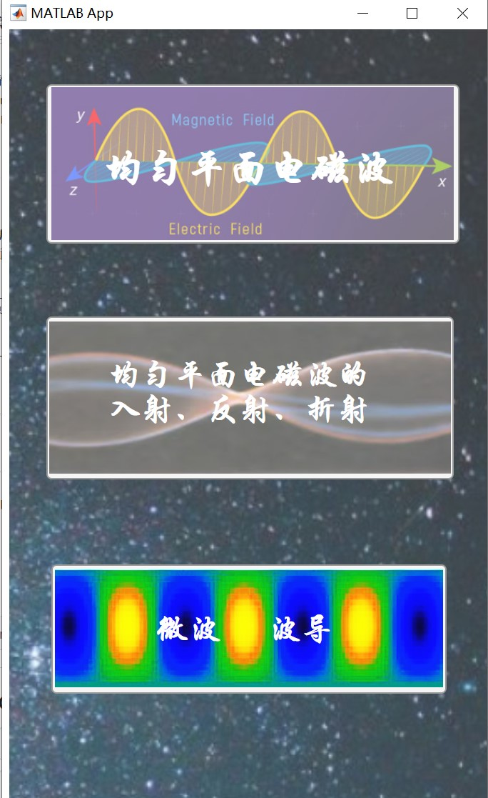
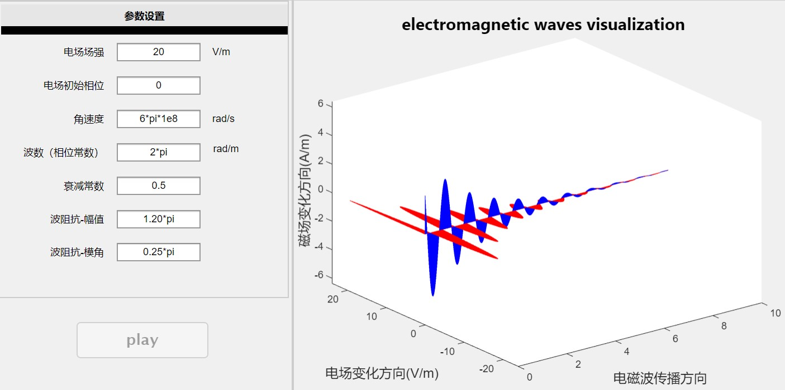
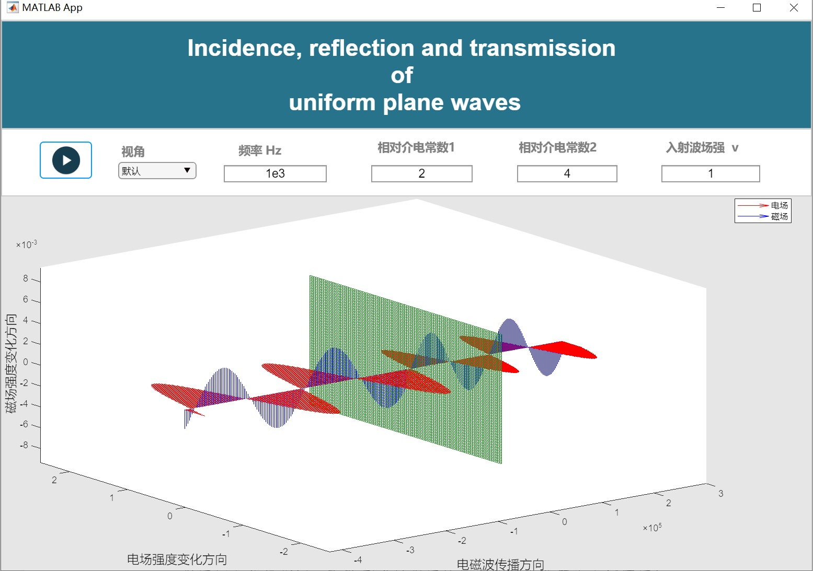
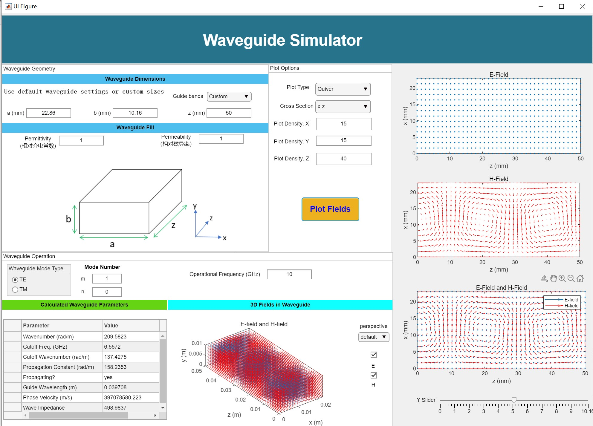

# electromagnetic_field_demo

  该程序基于matlab的app演示，适用于辅助电磁场与电磁波学习理解。
 
 ## 环境
 编写使用了matlab2022。运行所需的matlab版本需要支持matlab APP。
 
 ## 程序结构为：
 ```mermaid
graph LR
A[main1] -->B[main2]
B --> C[app1]
B --> D[app2]
B --> E[app3]
```

## 界面展示
- 主界面： 


- 选择界面：


- 仿真1 —— 均匀平面电磁波传播的仿真：


- 仿真2 —— 均匀平面电磁波的入射、反射、折射：



- 仿真3 —— 电磁波沿波导传输【参考[Katelyn Brinker的作品](Rectangular Waveguide Simulator - File Exchange - MATLAB Central (mathworks.com))】：  




> **—— by Pengfei Cai, dlut, 2022**


